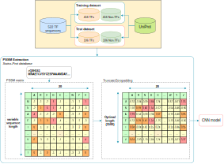
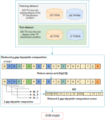

# Identifying Transcription Factors prefer Methylated DNA using Reduced G-Gap Dipeptide Composition
#### Q. H. Nguyen, Hoang V. Tran, [B. P. Nguyen](https://people.wgtn.ac.nz/b.nguyen), and Trang T. T. Do*

## Introduction
Transcription Factors (TFs) play an important role in gene expression and regulation of 3D genome conformation. TFs have ability to bind to specific DNA fragments called enhancers and promoters. Some TFs bind to promoter DNA fragments which are near the transcription initiation site and form complexes that allow polymerase enzymes to bind to the initiate transcription. Previous studies showed that methylated DNA has ability to inhibit and prevent TFs from binding to DNA fragments. However, recent studies have found that there are TFs that can bind to methylated DNA fragments. The identification of these TFs is an important steppingstone to a better understanding of cellular gene expression mechanisms. However, empirical methods are often time-consuming and labor-intensive, so developing machine learning methods is essential. In this study, we propose two machine learning methods for two problems: (1) classification of TFs, and (2) classification of TFs that prefer to bind to methylated DNAs (TFPMs) or non-methylated DNAs (TFPNM). For the TF classification problem, the proposed method uses the position-specific scoring matrix (PSSM) for data representation and a deep convolutional neural network (CNN) for modeling. This method achieved 90.56% sensitivity and 83.96% specificity on an independent test set. For the TFPM classification problem, the proposed method uses the reduced g-gap dipeptide composition for data representation and the support vector machine algorithm for modeling. This method achieved 82.61% sensitivity and 64.86% specificity on another independent test set. These results are higher than other studies on the same problems. 

## Identifying Transcription Factors

## Identifying Transcription Factors Prefer Methylated DNA

## Code
### Identifying Transcription Factors
1. Train models:
**train_pssm.py**
+ Input: PSSM files of sequences in the training set
+ Output: 5 CNN models stored in folder saved_models -- this folder will be created during model training
2. Inference: 
**test_pssm.py**
+ Input : PSSM files of sequences in the test set and 5 CNN models which were created during the training process.
+ Output: Sensitivity, Specificity, Accuracy, AUC, MCC (in test.csv)
3. Generate PSSM data from FASTA files
+ Step 1: Download and install NCBI-BLAST: ftp://ftp.ncbi.nlm.nih.gov/blast/executables/blast+/LATEST/
+ Step 2: Download NR database: ftp://ftp.ncbi.nlm.nih.gov/blast/db/FASTA/nr.gz
Then go to folder bin in BLAST to run the following commands:
+ Step 3: Format database: formatdb.exe -i <NR Database file> -o T
+ Step 4: psiblast.exe -num_iterations 3 -db <NR Database file> -in_msa <Fasta file> -out_ascii_pssm <PSSM Output file>
4. System Environments:
- Ubuntu 18.04
- scikit-learn version 1.0.2
- Keras version 2.8.0
- Tensorflow version 2.8.0

### Identifying Transcription Factors Prefer Methylated DNA
Code and results can be found in file **TFPM.ipynb**
  
## Webserver
Please access our webserver [here](http://103.159.50.147)

## Contact 
[Go to contact information](https://homepages.ecs.vuw.ac.nz/~nguyenb5/contact.html)
